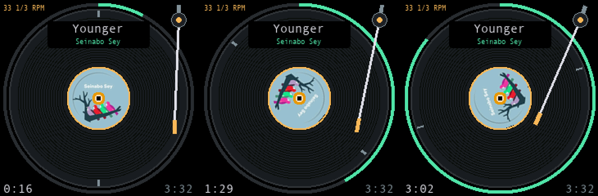

# mini-display

Custom ESP8266 firmware for a 1.54" 240×240 desk display — a GeekMagic "SmallTV"-style board. It is a
Spotify now-playing screen, a photo frame, and a clock with weather, all configured from a web
dashboard the device serves itself. No PC, bridge or Home Assistant is needed at runtime.

This is a fork of [iodn/geekmagic-tv-esp8266](https://github.com/iodn/geekmagic-tv-esp8266) and adds
Spotify, the photo frame, four clock faces, and a large amount of memory work to make them fit. See
[What this fork adds](#what-this-fork-adds).



*The Turntable face at three points in a track. The album art is the record's label and turns with it;
the tonearm tracks inward from the lead-in groove to the run-out; the ring around the rim is the
track's progress. Rendered from the firmware's own geometry (`src/turntable.h`) with real cover art.*

---

## Contents

- [What it does](#what-it-does)
- [What this fork adds](#what-this-fork-adds)
- [Display pages](#display-pages)
- [Hardware](#hardware)
- [Installing](#installing)
- [Setting up Spotify](#setting-up-spotify)
- [The web dashboard](#the-web-dashboard)
- [Recovery and factory reset](#recovery-and-factory-reset)
- [Building and development](#building-and-development)
- [Memory: why the firmware is shaped like this](#memory-why-the-firmware-is-shaped-like-this)
- [Credits](#credits)

---

## What it does

Three things, switched from the dashboard or cycled on a timer:

**Spotify Now Playing.** The device holds read-only credentials, refreshes its own access token against
`accounts.spotify.com`, and polls `GET /v1/me/player` over TLS. It shows whatever your account is
playing anywhere — phone, laptop, speaker. Four selectable layouts render the same data. The one
browser sign-in happens once on your PC with `tools/spotify_auth.py`, which prints a refresh token you
paste into the dashboard.

**Photo frame.** Prepare JPEGs on your PC with `tools/prepare_images.py`, upload them through the
dashboard, and they play as a full-screen slideshow with a configurable interval and optional shuffle.
Photos live on a 2 MB LittleFS partition and survive reboots.

**Clock and weather.** Time from NTP, current conditions and today's range from Open-Meteo over plain
HTTP with no API key. Four selectable clock faces, configurable digit colours, a blinking colon, and
weather icons drawn as vector primitives with day/night variants that follow real sunrise and sunset
times.

There is **no user button** on this board. Pages are switched from the dashboard's "Show now" control,
by `POST /page`, or automatically by the rotation timer.

---

## What this fork adds

31 commits, roughly 8,300 added lines on top of upstream. The substantial pieces:

| Area | What changed |
|---|---|
| **Spotify** | Entire subsystem, new. Token refresh, adaptive polling, album art over TLS, four faces, a PC-side OAuth helper, and a credentials panel in the dashboard. |
| **Photo frame** | Entire subsystem, new. Slideshow page, host-side image preparation, interval and shuffle. |
| **Clock** | One upstream layout replaced by four selectable faces with configurable colours and a blinking colon. |
| **Weather** | Icons redrawn as primitives keyed by WMO code with day/night variants; humidity, pressure and sunrise/sunset added to the feed; stale readings marked with their age. The standalone Weather page was **deleted**, because every clock face already showed more. |
| **Buttons** | Removed. Upstream read a button on GPIO4; this board has none, so paging moved to `POST /page` and a dashboard control. |
| **Memory** | 198 KB of flash and 2.8 KB of heap reclaimed without removing features; the web UI is gzipped at build time; WiFiManager dropped as redundant. |
| **Reliability** | NTP hardened to three servers with SNTP re-arming after a 15-minute stall; mDNS and OTA actually start (the upstream heap gate was set higher than this board ever reaches); uploaded images survive reboots. |
| **Tooling** | OTA flashing over WiFi, a reset-safe serial logger, host-side image preparation, and three checks that run on a laptop with no hardware. |

Everything was verified on real hardware before being committed. `HARDWARE.md` is the record of what
was measured, including the things that were tried and did not fit.

---

## Display pages

### Clock faces

Chosen with **Display → Clock → Clock face**, or the `clockFace` key.

| Value | Face | Layout |
|---|---|---|
| 0 | **Cards** | Rounded time card over a rounded weather card. The default. |
| 1 | **Bold** | Full-bleed: location badge, 48 px digits beside a 48 px temperature, rain and high/low chips. |
| 2 | **Matrix** | Instrument panel: time strip, a seconds bar that fills as the minute runs out, an NTP/link status tape, and precipitation, humidity and pressure wells. |
| 3 | **Radial** | Perimeter arc gauges: rain chance across the top, today's temperature range along the bottom with a marker for the current reading. |

All four are drawn with TFT_eSPI primitives straight to the panel. No bitmaps, no sprite, no
framebuffer, so they cost flash but zero heap. Hour, minute and second digits each take their own hex
colour.

### Spotify faces

Chosen with **Display → Spotify face**, or the `spotifyFace` key.

| Value | Face | What it shows |
|---|---|---|
| 0 | **Art** | Album art in an 80×80 slot, track and artist beside it, thin progress bar, and a telemetry strip with WiFi signal, both heaps as sampled during the poll, and poll latency. |
| 1 | **Text** | No art and no JPEG decoding at all. Big wrapped title, an animated equaliser, shuffle/repeat and volume. The lowest-memory face. |
| 2 | **Radial** | The whole track as one 360° ring from 12 o'clock with a needle head riding its end. |
| 3 | **Turntable** | A record. The album art is the label and turns with it, the tonearm tracks inward as the track plays, and the rim ring is the progress. |

**The equaliser on face 1 is an animation, not a measurement.** The device has no audio input and the
Spotify Web API sends no spectrum data. It is modelled rather than random — left columns swing higher
and decay slower like bass, right ones flicker — and it settles flat when playback pauses, which is the
one thing it reports truthfully. Face 0 carries the real telemetry if you want honest numbers.

**Not available from the Spotify Web API, so absent from every face:** bitrate, codec, queue position,
liked state, album year. There are also **no transport controls**: the board has no buttons and the
token is deliberately read-only.

### Photos

A full-screen slideshow of every `.jpg` in `/image/`. Interval (`photoIntervalSec`, default 15 s) and
shuffle (`photoShuffle`) are configurable. The page only becomes available once at least one photo
exists, so rotation skips it rather than showing a blank screen.

**Animated GIF is not supported**, and that was a measurement rather than an omission. The AnimatedGIF
decoder holds its state by value at 24,172 bytes against about 18 KB of free heap. It fits neither the
heap nor static RAM, so the memory went to Spotify instead. The full numbers are in `HARDWARE.md`.

### Inherited pages

Markets, Home Assistant, focus timer, world clocks, event countdown, quote and status pages came from
upstream and still work.

---

## Hardware

Confirmed on the board this was developed against:

| Item | Finding |
|---|---|
| MCU | ESP8266EX, QFN-32, ~80 KB RAM |
| Flash | 4 MB SPI NOR |
| Display | 1.54" 240×240 IPS, ST7789 controller |
| USB-serial | CH340, working DTR/RTS auto-reset, **115200 baud only** (higher rates corrupt) |
| Button | **None.** The SMD switch on the PCB is not a user button. |
| Power | AMS1117-3.3 LDO, USB-C |

Verified pin map:

| Signal | GPIO | Notes |
|---|---|---|
| SPI SCLK | 14 | hardware SPI, fixed |
| SPI MOSI | 13 | fixed |
| TFT DC | 0 | also the boot-mode pin |
| TFT RST | 2 | |
| TFT CS | none | tied to GND, so the panel needs **SPI mode 3** |
| Backlight | 5 | PWM |

Display settings: ST7789, 240×240, no offsets, `invertDisplay(true)`, **default RGB order** (not BGR),
SPI mode 3, 40 MHz.

Other ESP8266 SmallTV variants may need different pins or build flags. The ESP32-based SmallTV Pro is
not a target.

---

## Installing

> **Back up the stock firmware before writing anything.** The vendor image is proprietary and cannot be
> downloaded again.

```bash
# 1. identify the board
esptool --port /dev/cu.usbserial-10 chip-id
esptool --port /dev/cu.usbserial-10 flash-id

# 2. back up the stock firmware (4,194,304 bytes, about 6.5 minutes at 115200)
esptool --port /dev/cu.usbserial-10 -b 115200 read-flash 0 ALL backup/stock_backup.bin

# 3. build and flash
pio run -e esp12e
pio run -e esp12e -t upload --upload-port /dev/cu.usbserial-10
```

**The first flash must be over USB.** Do not use OTA to move from stock firmware, ESPHome or anything
else; OTA only works on a device already running this firmware.

After that, flash over WiFi instead:

```bash
pio run -e esp12e && tools/ota_update.sh
```

`tools/ota_update.sh` logs in to the dashboard with a session cookie, posts the firmware to `/update`,
and waits for the device to come back. It reads the password from `secrets/device_password` so it never
lands in your shell history. To restore the stock firmware:

```bash
esptool --port /dev/cu.usbserial-10 -b 115200 write-flash 0 backup/stock_backup.bin
```

### First boot

With no WiFi credentials saved, the device starts a failsafe access point called **`SmartClock-Setup`**
with a random 8-digit password, both shown on the panel along with `192.168.4.1`. There is no captive
portal, so type that address yourself. Log in, open the Network tab and pick a network from the scan.

WiFi credentials are kept in the SDK's own flash sector, so they survive a reflash. Only a factory reset
clears them.

---

## Setting up Spotify

OAuth happens once on your PC, not on the device. Spotify only accepts plain-HTTP redirect URIs for
loopback IP literals, and the ESP8266 cannot sensibly serve HTTPS.

1. Create an app at the [Spotify developer dashboard](https://developer.spotify.com/dashboard) and add
   `http://127.0.0.1:8888/callback` as a redirect URI.
2. Run the helper on your PC. It is standard library only, no dependencies:

   ```bash
   python3 tools/spotify_auth.py --client-id <id> --client-secret <secret>
   ```

   It opens your browser, completes the Authorization Code flow with the read-only scopes
   `user-read-currently-playing` and `user-read-playback-state`, and prints a refresh token.
3. Paste the client ID, client secret and refresh token into the **Spotify panel under the dashboard's
   Feeds tab**, along with the idle timeout and whether to download album art.

The device refreshes its own access token from then on.

**Spotify policy, checked September 2026:** apps in Development Mode require the app owner to hold an
active Premium subscription and are capped at 5 users. Add the listening account under the app's User
Management.

### Poll cadence

A poll blocks the single `loop()` for about 1.4 seconds even with TLS session resumption — that is the
key exchange on an 80 MHz core with no crypto acceleration, and nothing removes it. A flat 5-second poll
would freeze the display 28% of the time, so the interval adapts instead, and the progress bar
interpolates locally between polls:

| State | Interval | Duty cycle |
|---|---|---|
| Idle | 30 s | ~5% |
| Playing, mid-track | 15 s | ~9% |
| Last 20 s of a track | 5 s | ~28%, briefly |

HTTP 429 is honoured with its `Retry-After`. `/spotify.json` exposes `nextPollInMs` so the cadence is
observable from a browser.

---

## The web dashboard

Served from the device at `http://<device-ip>/` or `http://<hostname>.local/`. Tabs cover **Display**,
**Feeds**, **Home Assistant**, **Widgets**, **Network** and **System**, with a separate firmware upload
page at `/update`.

**Logging in.** The username is `admin`. On first boot the device generates a random 10-digit password
and stores only its hash. If you never wrote it down, the login screen has a **"Show password on
device"** button that prints it on the 240×240 panel for 15 seconds. That button deliberately needs no
session, which is the entire point of it. A session cookie then authorises everything else, with a
12-hour sliding idle timeout.

**Live preview versus save.** Most controls post the whole form about 180 ms after you stop typing,
apply it over the saved config and repaint the panel without writing anything to flash. Only *Save*
persists. That matters on a device with a limited flash write budget, and it means you can try every
clock face in a few seconds and walk away without having changed anything.

The dashboard HTML is stored in PROGMEM and gzipped at build time by `tools/prebuild.py`, which takes
it from about 141 KB of the 1 MB sketch slot down to roughly 24 KB, served with `Content-Encoding:
gzip`.

Selected routes:

| Method | Path | Purpose |
|---|---|---|
| `GET` | `/` | dashboard |
| `POST` | `/auth/login` | session login |
| `GET` | `/dashboard.json` | full config and data |
| `POST` | `/dashboard/live` | apply without saving (preview) |
| `POST` | `/dashboard/save` | persist to flash |
| `POST` | `/page` | next page, or `?id=N` to jump |
| `GET` | `/spotify.json` | Spotify status, including `nextPollInMs` |
| `POST` | `/spotify/save` | store credentials |
| `POST` | `/image/upload` | multipart JPEG upload |
| `POST` | `/image/show` | pin one image over every page |
| `POST` | `/delete` | delete a file |
| `GET` | `/log` | recent log lines (a 16-line ring buffer) |
| `POST` | `/update` | web OTA |
| `GET` | `/space.json` | filesystem usage |

All routes except the login endpoints sit behind the session cookie.

---

## Recovery and factory reset

This is the most surprising part of the firmware, so it is worth reading before you debug anything.

**DTR and RTS on the CH340 are wired to RESET and GPIO0.** That is what lets `pio run -t upload` flash
without holding a button, and it means **every open and every close of the serial port reboots the
board**. An ordinary `pio device monitor` session is therefore two reboots, not zero.

Two counters react to that:

| Counter | Threshold | Effect | Clears after |
|---|---|---|---|
| Boot failure | **2** | **Recovery mode** — disables the Spotify and feed loops | 30 s of running |
| Power cycle | **5** | **Factory reset** — wipes WiFi *and* Spotify credentials | the same successful boot |

The power-cycle counter only counts boots whose reset reason is power-on or an external reset, so a
crash, a software restart or an OTA reboot does not advance it and in fact clears it. The boot-failure
counter is not so choosy, which is why two serial sessions in quick succession are enough.

Recovery mode leaves the display working, so the symptom is a Spotify page that renders but never
populates, which looks exactly like broken code. **Check the boot banner for `RECOVERY MODE` first.**

To watch the serial port without rebooting the board, use `tools/bootlog.py`, which holds DTR and RTS
low across the open. If a factory reset does fire, WiFi is re-entered through the failsafe AP, but the
Spotify credentials are gone and `tools/spotify_auth.py` has to be run again. Keep a copy.

---

## Building and development

```bash
pio run -e esp12e          # build (tools/prebuild.py regenerates the gzipped web UI)
tools/ota_update.sh        # flash over WiFi
```

The `esp12e` environment pins `eagle.flash.4m2m.ld`: 1 MB for the sketch plus OTA space, 2 MB for
LittleFS.

Three checks run on a laptop with no hardware attached:

```bash
python3 tools/spotify_auth.py --selftest                              # OAuth URL and state handling
c++ -std=c++17 -o /tmp/t  tools/test_spotify_url.cpp  && /tmp/t       # album-art URL parser
c++ -std=c++17 -o /tmp/tt tools/test_turntable.cpp && /tmp/tt /tmp    # turntable geometry + PPM frames
python3 tools/prepare_images.py --selftest                            # image conversion
```

The turntable check is worth knowing about: it renders the face on your PC and asserts the geometry
that cannot be eyeballed on a 1.54" panel — that the tonearm never touches the label, that drawing then
erasing restores the picture bit for bit, and that the rotated label is exact at a quarter turn. It
writes four PPM frames so a change can be reviewed before it is flashed.

---

## Memory: why the firmware is shaped like this

A 240×240 16-bit framebuffer is 115,200 bytes. The ESP8266 has 81,920 bytes of RAM in total, and this
build already uses about 56,000 of them statically. **There is no framebuffer and there never can be.**
Everything decodes in blocks or lines and is pushed straight to the panel.

Consequences that shaped most of the design:

- **TLS costs about 10 KB of DRAM.** Only one connection at a time, ever.
- **Spotify's JSON is large**, so it is parsed through an ArduinoJson filter that keeps only the fields
  actually rendered, and the filter is built once rather than per poll.
- **Fixed buffers, never `String` concatenation on the poll path.** Every Spotify failure during
  development traced back to heap fragmentation in our own code, not to Spotify.
- **`ESP.getFreeHeap()` reports DRAM only.** A second heap lives in IRAM and must be budgeted
  separately; the Art face shows both, sampled during the poll.
- **Album art** is streamed to LittleFS 512 bytes at a time, verified against `Content-Length`, and
  decoded from the file. It is never buffered in RAM.

`HARDWARE.md` has the measurements behind all of this.

---

## Credits

Built on the work of:

- **[iodn/geekmagic-tv-esp8266](https://github.com/iodn/geekmagic-tv-esp8266)** — the upstream firmware
  this is forked from: the display setup, web dashboard, settings storage, feeds and page framework.
- **[TFT_eSPI](https://github.com/Bodmer/TFT_eSPI)** by Bodmer — display driver.
- **[TJpg_Decoder](https://github.com/Bodmer/TJpg_Decoder)** by Bodmer — JPEG decoding.
- **[ArduinoJson](https://github.com/bblanchon/ArduinoJson)** by Benoît Blanchon — JSON parsing and the
  filter that makes the Spotify response fit.
- **[AnimatedGIF](https://github.com/bitbank2/AnimatedGIF)** by Larry Bank — evaluated for GIF playback
  and measured as too large for this board. Not shipped, but the measurement shaped the design.
- **[Open-Meteo](https://open-meteo.com/)** — weather and geocoding, no API key required.

Display drivers, JPEG decoding and JSON parsing are never hand-rolled in this project.

## License

MIT. See [LICENSE](LICENSE).
